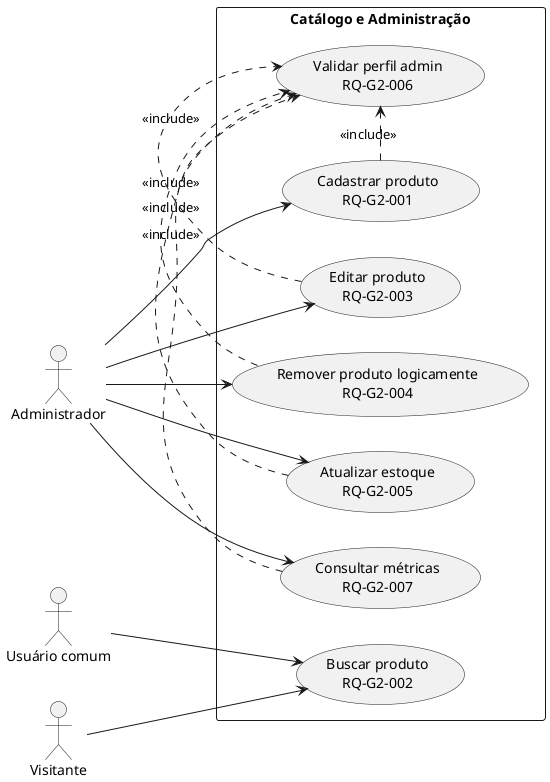
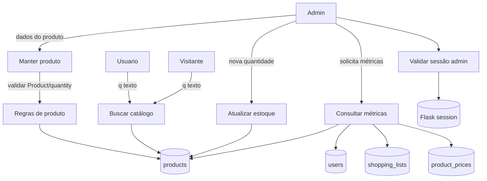
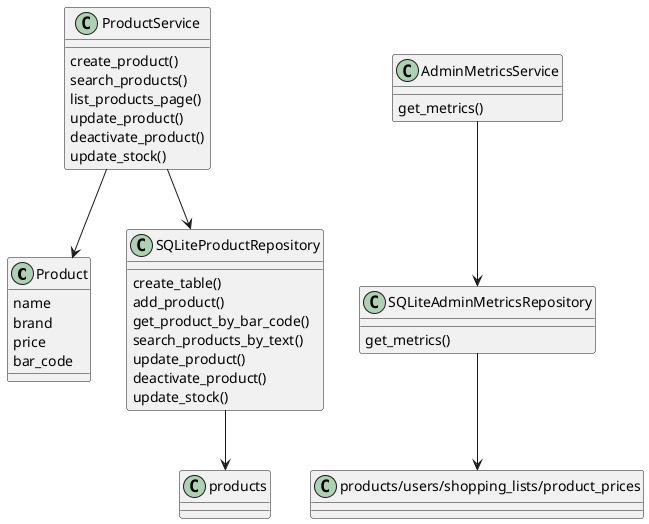
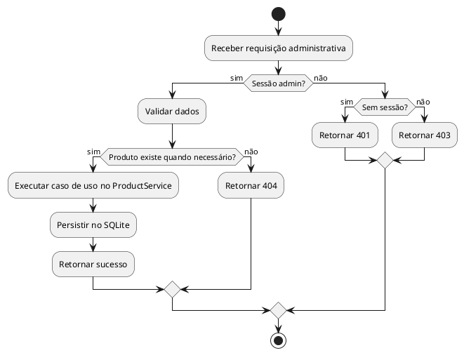

# Grupo 2 — Catálogo, produtos, estoque e painel administrativo

## A. Integrantes responsáveis

- Dionilton Oliveira Silva.
- Jhonny Rodrigues de Sousa.

## B. Responsabilidade do grupo

Este grupo representa o catálogo de produtos e as operações administrativas: cadastro, busca, edição, remoção lógica, atualização de estoque, consistência por código de barras, proteção por perfil admin e métricas administrativas simples.

## C. Arquivos de código relacionados

| Tipo | Arquivo | Função |
|---|---|---|
| Domínio | `app/domain/product.py` | Entidade `Product` e validação de nome, marca, preço e código de barras. |
| Domínio | `app/domain/quantity.py` | Validação de quantidade não negativa. |
| Aplicação | `app/application/product_service.py` | Casos de uso de produto, busca, edição, remoção lógica e estoque. |
| Aplicação | `app/application/admin_metrics_service.py` | Consulta de métricas administrativas. |
| Infraestrutura | `app/infrastructure/product_repository.py` | Tabela `products`, busca, atualização, estoque e active. |
| Infraestrutura | `app/infrastructure/admin_metrics_repository.py` | Contagens em tabelas principais. |
| Web | `app/web/routes.py` | Rotas JSON de produtos. |
| Web | `app/web/admin_metrics_routes.py` | Rota `/admin/metrics`. |
| Web | `app/web/html_routes.py` | Catálogo, cadastro HTML de produto e painel admin. |
| Templates | `products.html`, `new_product.html`, `admin_dashboard.html`, `product_detail.html` | Interface de catálogo e administração. |
| Testes | `test_product.py`, `test_product_service.py`, `test_product_repository.py`, `test_product_routes.py`, `test_admin_metrics_*`, `test_html_routes.py` | Cobertura unitária e integração. |

## D. Estórias e requisitos atendidos

| RQ | Estória | Descrição | Critério de aceitação | Arquivos | Rotas | Testes | Status |
|---|---|---|---|---|---|---|---|
| RQ-G2-001 | AD01 | Administrador cadastra produto com nome, marca, preço, código de barras e quantidade. | HTTP 201 para válido; 400 para inválido; 409 para duplicado. | `product.py`, `product_service.py`, `product_repository.py`, `routes.py` | `POST /products`, `GET/POST /admin/products/new` | `test_product_routes.py`, `test_html_routes.py` | Implementado |
| RQ-G2-002 | US02 | Usuário busca produtos por parte do nome ou marca. | Busca retorna compatíveis; sem resultado retorna lista vazia. | `product_service.py`, `product_repository.py`, `routes.py`, `html_routes.py` | `GET /products`, `GET /catalog` | `test_product_service.py`, `test_product_repository.py`, `test_product_routes.py` | Implementado |
| RQ-G2-003 | AD02 | Administrador edita nome, marca e preço de produto existente. | Existente retorna 200; inexistente 404; inválido 400. | `product_service.py`, `product_repository.py`, `routes.py` | `PUT /products/<bar_code>` | `test_product_service.py`, `test_product_repository.py`, `test_product_routes.py` | Implementado |
| RQ-G2-004 | AD02 | Administrador remove produto logicamente. | Produto fica no banco com `active=0` e não aparece em buscas. | `product_repository.py`, `product_service.py`, `routes.py` | `DELETE /products/<bar_code>` | `test_product_repository.py`, `test_product_routes.py` | Implementado |
| RQ-G2-005 | AD03 | Administrador atualiza quantidade de estoque. | Quantidade válida retorna 200; negativa retorna 400; inexistente retorna 404. | `quantity.py`, `product_service.py`, `product_repository.py`, `routes.py` | `PATCH /products/<bar_code>/stock` | `test_product_service.py`, `test_product_repository.py`, `test_product_routes.py` | Implementado |
| RQ-G2-006 | RNF02 | Rotas administrativas de produto exigem admin. | Visitante 401; usuário comum 403; admin permitido. | `authorization.py`, `routes.py` | `POST/PUT/DELETE/PATCH /products...` | `test_product_routes.py` | Implementado |
| RQ-G2-007 | AD04 | Administrador consulta métricas simples. | Admin recebe totais; usuário comum 403; visitante 401. | `admin_metrics_service.py`, `admin_metrics_repository.py`, `admin_metrics_routes.py` | `GET /admin/metrics`, `GET /admin/dashboard` | `test_admin_metrics_*`, `test_html_routes.py` | Implementado |
| RQ-G2-008 | AD05 | Aprovar ou rejeitar produtos sugeridos por usuários. | Admin lista pendentes, aprova criando produto no catálogo ou rejeita com justificativa. | `product_suggestion_service.py`, `product_suggestion_repository.py`, `product_suggestion_routes.py`, `html_routes.py` | `/product-suggestions`, `/admin/product-suggestions` | `test_product_suggestion_routes.py` | Implementado |

## E. Descrição textual para Diagrama de Casos de Uso

Atores: administrador, usuário comum, visitante.  
Fronteira: módulo de catálogo e administração.  
Casos: cadastrar produto, buscar produto, editar produto, remover produto logicamente, atualizar estoque, consultar métricas, bloquear usuário não admin.

Pré-condições: tabela `products` criada; admin autenticado para operações administrativas.  
Pós-condições: produto persistido/alterado/inativado; estoque atualizado; métricas retornadas.  
Exceções: código duplicado, dados inválidos, produto inexistente, acesso não autorizado.

## F. Fichas de Caso de Uso

### UC-G2-001 — Cadastrar produto

- Atores: administrador.
- Requisitos: RQ-G2-001, RQ-G2-006.
- Pré-condições: sessão admin; código de barras não cadastrado.
- Pós-condições: registro criado em `products` com `active=1`.
- Fluxo principal: admin envia dados; sistema valida `Product` e `quantity`; repositório verifica duplicidade; insere produto; retorna 201/redirect.
- Exceções: 400 para dados inválidos; 409 para duplicidade; 401/403 por autorização.
- Entrada: `name`, `brand`, `price`, `bar_code`, `quantity`.
- Saída: produto serializado.
- Componentes: `Product`, `ProductService.create_product`, `SQLiteProductRepository.add_product`, `/products`.

### UC-G2-002 — Buscar produto

- Atores: visitante, usuário comum, administrador.
- Requisitos: RQ-G2-002.
- Pré-condições: catálogo pode estar vazio.
- Pós-condições: lista de produtos ativos compatíveis.
- Fluxo: usuário informa `q`; serviço busca por nome ou marca; retorno JSON ou HTML.
- Alternativo: query vazia no serviço retorna lista vazia no método `search_products`; catálogo HTML lista produtos com paginação.
- Componentes: `search_products`, `list_products_page`, `/products`, `/catalog`.

### UC-G2-003 — Editar produto

- Atores: administrador.
- Requisitos: RQ-G2-003, RQ-G2-006.
- Pré-condições: produto existente; sessão admin.
- Pós-condições: nome, marca e preço atualizados; código de barras preservado.
- Exceções: inexistente 404; inválido 400.
- Componentes: `ProductService.update_product`, `SQLiteProductRepository.update_product`.

### UC-G2-004 — Remover produto logicamente

- Atores: administrador.
- Requisitos: RQ-G2-004, RQ-G2-006.
- Pré-condições: produto existente.
- Pós-condições: `active=0`; buscas públicas deixam de exibir produto.
- Componentes: `deactivate_product`, `DELETE /products/<bar_code>`.

### UC-G2-005 — Atualizar estoque

- Atores: administrador.
- Requisitos: RQ-G2-005.
- Pré-condições: produto existente; quantidade não negativa.
- Pós-condições: campo `quantity` atualizado.
- Componentes: `validate_quantity`, `update_stock`, `PATCH /products/<bar_code>/stock`.

### UC-G2-006 — Consultar métricas administrativas

- Atores: administrador.
- Requisitos: RQ-G2-007.
- Pré-condições: sessão admin.
- Pós-condições: totais de produtos, usuários, listas e preços retornados.
- Componentes: `AdminMetricsService.get_metrics`, `SQLiteAdminMetricsRepository.get_metrics`.

## G. Descrição textual para DFD

Entidades externas: administrador, usuário/visitante.  
Processos: manter produto, consultar catálogo, atualizar estoque, calcular métricas, validar admin.  
Depósitos: `products`, `users`, `shopping_lists`, `product_prices`, sessão Flask.

## H. Descrição textual para Diagrama de Classes

## I. Descrição textual para Diagrama de Atividades

## J. Assertivas de entrada, saída e corretude das funções

| Função | Arquivo | Propósito | Entrada | Saída | Invariante/corretude | Efeitos/erros | Requisitos | Testes |
|---|---|---|---|---|---|---|---|---|
| `Product.__init__` | `domain/product.py` | Criar produto válido. | nome, marca, preço, código. | `Product`. | Preço finito não negativo e textos não vazios. | `InvalidProductError`. | RQ-G2-001 | `test_product.py` |
| `validate_quantity` | `domain/quantity.py` | Validar quantidade. | inteiro não booleano. | inteiro validado. | Quantidade não negativa. | `InvalidQuantityError`. | RQ-G2-005 | `test_product_service.py` |
| `ProductService.create_product` | `application/product_service.py` | Criar produto. | dados e quantidade. | `Product`. | Produto não é instanciado na rota. | duplicidade/validação. | RQ-G2-001 | `test_product_routes.py` |
| `ProductService.search_products` | `application/product_service.py` | Buscar por texto. | query string. | lista. | Query vazia retorna lista vazia. | nenhum. | RQ-G2-002 | `test_product_service.py` |
| `ProductService.list_products_page` | `application/product_service.py` | Paginar catálogo. | query, página, tamanho. | produtos, página, total. | Página mínima 1. | nenhum. | RQ-G2-002 | `test_html_routes.py` |
| `ProductService.get_product` | `application/product_service.py` | Consultar produto. | código. | produto/quantidade. | Produto ativo ou registrado é retornado via repo. | `ProductNotFoundError`. | RQ-G2-002 | testes de carrinho/listas |
| `ProductService.update_product` | `application/product_service.py` | Editar dados. | código, nome, marca, preço. | produto atualizado. | Código não muda. | 404/400. | RQ-G2-003 | `test_product_service.py` |
| `ProductService.deactivate_product` | `application/product_service.py` | Remover logicamente. | código. | `None`. | Não executa DELETE físico. | 404. | RQ-G2-004 | `test_product_repository.py` |
| `ProductService.update_stock` | `application/product_service.py` | Alterar estoque. | código, quantidade. | produto/quantidade. | Quantidade validada antes de persistir. | 400/404. | RQ-G2-005 | `test_product_routes.py` |
| `SQLiteProductRepository.create_table` | `infrastructure/product_repository.py` | Criar/migrar produtos. | conexão. | tabela com `active`. | Preserva bancos antigos adicionando coluna. | DDL/commit. | RQ-G2-001/004 | `test_product_repository.py` |
| `SQLiteProductRepository.add_product` | `infrastructure/product_repository.py` | Inserir produto. | `Product`, quantidade. | registro. | Código é chave primária. | `DuplicateBarcodeError`. | RQ-G2-001 | `test_product_repository.py` |
| `SQLiteProductRepository.search_products_by_text` | `infrastructure/product_repository.py` | Busca SQL. | query. | lista ativa. | Filtra `active=1`. | leitura. | RQ-G2-002/004 | `test_product_repository.py` |
| `SQLiteProductRepository.update_product` | `infrastructure/product_repository.py` | Atualizar campos editáveis. | `Product`. | commit. | Não altera código. | escrita. | RQ-G2-003 | `test_product_repository.py` |
| `SQLiteProductRepository.deactivate_product` | `infrastructure/product_repository.py` | Marcar inativo. | código. | commit. | `active=0`. | escrita. | RQ-G2-004 | `test_product_repository.py` |
| `SQLiteProductRepository.update_stock` | `infrastructure/product_repository.py` | Atualizar quantidade. | código, quantidade. | commit. | Validação de quantidade. | escrita. | RQ-G2-005 | `test_product_repository.py` |
| `create_product_blueprint` | `web/routes.py` | Rotas JSON de produto. | `ProductService`. | `Blueprint`. | Rotas chamam serviço. | sessão/admin. | RQ-G2-001..006 | `test_product_routes.py` |
| `AdminMetricsService.get_metrics` | `application/admin_metrics_service.py` | Obter totais. | repo inicializado. | dict de métricas. | Serviço não acessa SQL direto. | nenhum. | RQ-G2-007 | `test_admin_metrics_repository.py` |
| `SQLiteAdminMetricsRepository.get_metrics` | `infrastructure/admin_metrics_repository.py` | Contar tabelas. | conexão. | dict. | Conta quatro tabelas. | leitura SQL. | RQ-G2-007 | `test_admin_metrics_repository.py` |
| `create_admin_metrics_blueprint` | `web/admin_metrics_routes.py` | Rota de métricas. | serviço. | `Blueprint`. | Decorada com admin. | 401/403. | RQ-G2-007 | `test_admin_metrics_routes.py` |

## K. Rastreabilidade do grupo

| Estória | RQ | Caso de uso | DFD | Classe | Atividade | Código | Função/rota | Teste | Status | Observações |
|---|---|---|---|---|---|---|---|---|---|---|
| AD01 | RQ-G2-001 | UC-G2-001 | P1 | `Product` | admin produto | `routes.py` | `POST /products` | `test_product_routes.py` | Implementado | Protegido por admin. |
| US02 | RQ-G2-002 | UC-G2-002 | P3 | `ProductService` | busca | `product_repository.py` | `GET /products`, `/catalog` | `test_product_repository.py` | Implementado | Busca nome/marca. |
| AD02 | RQ-G2-003 | UC-G2-003 | P1 | `ProductService` | edição | `product_service.py` | `PUT /products/<bar_code>` | `test_product_service.py` | Implementado | Código preservado. |
| AD02 | RQ-G2-004 | UC-G2-004 | P1/D1 | `SQLiteProductRepository` | remoção lógica | `product_repository.py` | `DELETE /products/<bar_code>` | `test_product_repository.py` | Implementado | `active=0`. |
| AD03 | RQ-G2-005 | UC-G2-005 | P4/D1 | `validate_quantity` | estoque | `product_service.py` | `PATCH /stock` | `test_product_routes.py` | Implementado | Negativo rejeitado. |
| RNF02 | RQ-G2-006 | todos admin | P6 | `authorization` | autorização | `authorization.py` | `admin_required` | `test_product_routes.py` | Implementado | Web apenas. |
| AD04 | RQ-G2-007 | UC-G2-006 | P5 | `AdminMetricsService` | métricas | `admin_metrics_repository.py` | `/admin/metrics` | `test_admin_metrics_routes.py` | Implementado | Métricas simples. |
| AD05 | RQ-G2-008 | UC-G2-007 | P7 | `ProductSuggestion` | sugestão produto | `product_suggestion_service.py` | `/admin/product-suggestions` | `test_product_suggestion_routes.py` | Implementado | Aprovação cria produto ativo. |
