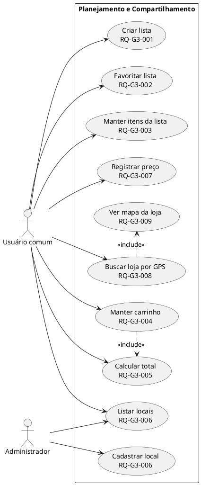
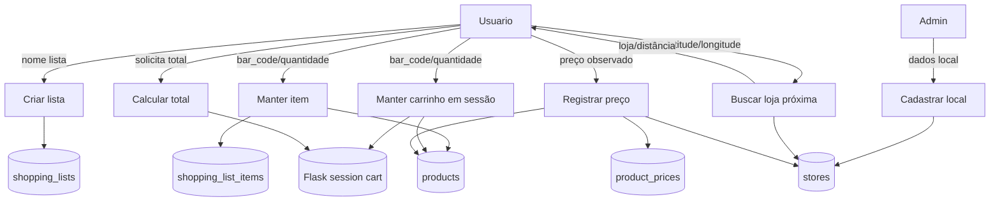
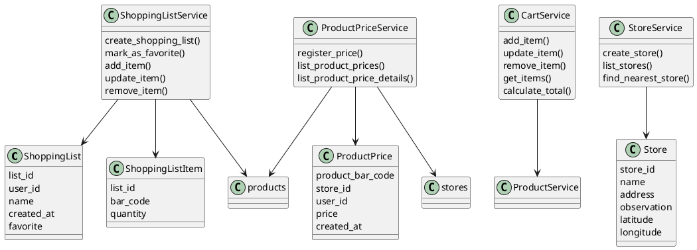
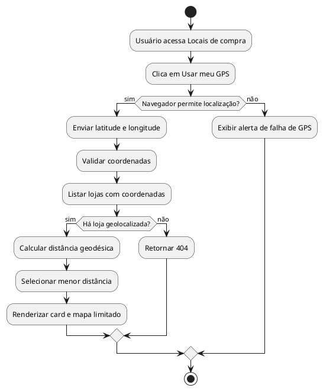

# Grupo 3 — Listas de compras, carrinho, preços, locais e total estimado

## A. Integrantes responsáveis

- Gabriel Dylan.
- Gabriel Campello.
- Luiz Otávio.

## B. Responsabilidade do grupo

Este grupo representa os fluxos de planejamento e comparação de compras: criação e edição de listas, lista favorita, itens de lista, carrinho em sessão, total estimado, locais de compra, loja mais próxima por GPS, mapa e registros de preços por produto/local.

## C. Arquivos de código relacionados

| Tipo | Arquivo | Função |
|---|---|---|
| Domínio | `shopping_list.py` | Entidades `ShoppingList` e `ShoppingListItem`. |
| Domínio | `product_price.py` | Entidade `ProductPrice`. |
| Domínio | `store.py` | Entidade `Store` com coordenadas opcionais. |
| Aplicação | `shopping_list_service.py` | Listas, favorita e itens. |
| Aplicação | `cart_service.py` | Carrinho em sessão e total. |
| Aplicação | `store_service.py` | Locais e loja mais próxima via `geopy`. |
| Aplicação | `product_price_service.py` | Registro e consulta de preços observados. |
| Infraestrutura | `shopping_list_repository.py`, `store_repository.py`, `product_price_repository.py` | Persistência SQLite. |
| Web | `shopping_list_routes.py`, `cart_routes.py`, `store_routes.py`, `product_price_routes.py`, `html_routes.py` | Rotas JSON e HTML. |
| Templates | `shopping_lists.html`, `shopping_list_detail.html`, `cart.html`, `stores.html`, `new_store.html`, `product_detail.html` | Interface de listas, carrinho, lojas, GPS/mapa e preços. |
| Testes | `test_shopping_list*`, `test_cart_routes.py`, `test_cart_service.py`, `test_store*`, `test_product_price*`, `test_html_routes.py`, `test_mvp_html_routes.py` | Testes unitários e integração. |

## D. Estórias e requisitos atendidos

| RQ | Estória | Descrição | Critério de aceitação | Arquivos | Rotas | Testes | Status |
|---|---|---|---|---|---|---|---|
| RQ-G3-001 | US03 | Criar lista de compras autenticada. | Usuário autenticado recebe 201; nome vazio 400; visitante 401. | `shopping_list_service.py`, `shopping_list_repository.py`, `shopping_list_routes.py` | `POST /shopping-lists`, `/shopping-lists/view` | `test_shopping_list_*` | Implementado |
| RQ-G3-002 | US03 | Marcar lista favorita. | Apenas lista própria pode ser favorita; uma favorita por usuário. | `shopping_list_service.py`, `shopping_list_repository.py` | `PATCH /shopping-lists/<id>/favorite`, HTML favorite | `test_shopping_list_service.py`, `test_shopping_list_repository.py` | Implementado |
| RQ-G3-003 | US03 | Adicionar, alterar e remover itens de lista. | Produto existente; quantidade positiva; usuário só altera lista própria. | `shopping_list_service.py`, `shopping_list_repository.py` | `POST/PATCH/DELETE /shopping-lists/<id>/items...` | `test_shopping_list_routes.py` | Implementado |
| RQ-G3-004 | US04 | Manter carrinho em sessão. | Adicionar, alterar, remover e listar itens durante a sessão. | `cart_service.py`, `cart_routes.py`, `html_routes.py` | `/cart`, `/cart/items`, `/cart/view` | `test_cart_routes.py`, `test_mvp_html_routes.py` | Implementado |
| RQ-G3-005 | US05 | Calcular total estimado. | Total = soma de `price * quantity`; carrinho vazio retorna 0. | `cart_service.py`, `cart_routes.py` | `GET /cart/total`, `/cart/view` | `test_cart_service.py`, `test_cart_routes.py` | Implementado |
| RQ-G3-006 | US06 | Cadastrar e listar locais de compra. | Admin cadastra; usuário autenticado lista; inválido 400. | `store.py`, `store_service.py`, `store_repository.py`, `store_routes.py` | `POST /stores`, `GET /stores`, `/stores/view` | `test_store_*` | Implementado |
| RQ-G3-007 | US06 | Registrar preço observado por produto e local. | Usuário autenticado registra; produto/local inexistente 404; preço negativo 400. | `product_price_service.py`, `product_price_repository.py`, `product_price_routes.py` | `POST /prices`, `GET /products/<bar_code>/prices` | `test_product_price_*` | Implementado |
| RQ-G3-008 | US06/GPS | Buscar loja mais próxima por coordenadas. | Usuário autenticado envia latitude/longitude; recebe loja e distância. | `store_service.py`, `store_routes.py`, `html_routes.py`, `stores.html` | `/stores/nearest`, `/stores/nearest/view` | `test_store_routes.py`, `test_html_routes.py` | Implementado |
| RQ-G3-009 | US06/WEB | Exibir mapa limitado da loja mais próxima. | Página mostra apenas mapa e loja mais próxima, sem sobrepor tela. | `stores.html`, `base.html` | `/stores/nearest/view` | `test_html_routes.py` | Implementado |
| RQ-G3-010 | US07 | Controlar itens não comprados/pendentes. | Usuário move item total ou parcial de lista própria para pendências e consulta menor preço observado. | `pending_purchase_service.py`, `pending_purchase_repository.py`, `pending_purchase_routes.py`, `html_routes.py` | `/pending-items`, `/shopping-lists/<id>/items/<bar_code>/pending`, `/pending-items/view` | `test_pending_purchase_routes.py` | Implementado |

## E. Descrição textual para Diagrama de Casos de Uso

Atores: usuário comum, administrador, visitante.  
Fronteira: módulo de planejamento de compras e comparação de preços.

Pré-condições: usuário autenticado para listas/carrinho/lojas/preços; admin para cadastro de loja.  
Pós-condições: listas e itens persistidos; carrinho alterado na sessão; preços e lojas persistidos; mapa exibido quando coordenadas existem.  
Exceções: lista alheia, produto inexistente, local inexistente, quantidade inválida, preço negativo, GPS inválido.

## F. Fichas de Caso de Uso

### UC-G3-001 — Criar lista de compras

- Atores: usuário comum.
- Requisitos: RQ-G3-001.
- Fluxo: usuário informa nome; serviço cria `ShoppingList` com `user_id` e `created_at`; repositório persiste; sistema retorna lista.
- Exceções: nome vazio 400; visitante 401.
- Componentes: `ShoppingListService.create_shopping_list`, `POST /shopping-lists`.

### UC-G3-002 — Manter itens da lista

- Atores: usuário comum.
- Requisitos: RQ-G3-003.
- Fluxo: usuário seleciona produto e quantidade; serviço valida posse da lista, produto existente e quantidade positiva; repositório insere/atualiza/remove.
- Exceções: lista alheia 404; produto inexistente 404; quantidade inválida 400.
- Componentes: `add_item`, `update_item`, `remove_item`.

### UC-G3-003 — Manter carrinho

- Atores: usuário comum.
- Requisitos: RQ-G3-004, RQ-G3-005.
- Fluxo: usuário adiciona produto ao carrinho; sistema consulta produto; grava quantidade em `session["cart"]`; total é calculado por item.
- Exceções: produto inexistente 404; quantidade inválida 400; item inexistente no update/remove.
- Componentes: `CartService`, `cart_routes.py`, `cart.html`.

### UC-G3-004 — Gerenciar locais e GPS

- Atores: administrador, usuário comum.
- Requisitos: RQ-G3-006, RQ-G3-008, RQ-G3-009.
- Fluxo: admin cadastra local com coordenadas; usuário usa GPS; serviço calcula distância com `geopy`; HTML mostra card e mapa Leaflet.
- Exceções: coordenadas inválidas; nenhum local geolocalizado.
- Componentes: `StoreService.find_nearest_store`, `/stores/nearest/view`, `stores.html`.

### UC-G3-005 — Registrar preço observado

- Atores: usuário comum.
- Requisitos: RQ-G3-007.
- Fluxo: usuário informa produto, local e preço; serviço valida produto/local; cria `ProductPrice`; repositório salva histórico.
- Exceções: produto/local inexistente; preço negativo.

## G. Descrição textual para DFD

## H. Descrição textual para Diagrama de Classes

## I. Descrição textual para Diagrama de Atividades

## J. Assertivas de entrada, saída e corretude das funções

| Função | Arquivo | Propósito | Entrada | Saída | Invariante/corretude | Efeitos/erros | Requisitos | Testes |
|---|---|---|---|---|---|---|---|---|
| `ShoppingList.__init__` | `domain/shopping_list.py` | Criar lista válida. | user_id, nome, data. | lista. | Nome não vazio; favorite booleano. | `InvalidShoppingListError`. | RQ-G3-001/002 | `test_shopping_list.py` |
| `ShoppingListItem.__init__` | `domain/shopping_list.py` | Criar item válido. | list_id, bar_code, quantity. | item. | Quantidade > 0. | erro de lista. | RQ-G3-003 | `test_shopping_list_service.py` |
| `ShoppingListService.create_shopping_list` | `application/shopping_list_service.py` | Criar lista. | user_id, nome. | lista persistida. | Associa ao usuário da sessão. | validação. | RQ-G3-001 | `test_shopping_list_routes.py` |
| `ShoppingListService.mark_as_favorite` | `application/shopping_list_service.py` | Favoritar lista. | user_id, list_id. | lista favorita. | Uma favorita por usuário. | 404 se alheia. | RQ-G3-002 | `test_shopping_list_service.py` |
| `ShoppingListService.add_item` | `application/shopping_list_service.py` | Adicionar item. | user_id, list_id, bar_code, quantity. | item. | Produto deve existir e lista ser própria. | 400/404. | RQ-G3-003 | `test_shopping_list_routes.py` |
| `ShoppingListService.get_shopping_list_details` | `application/shopping_list_service.py` | Detalhar lista. | user_id/list_id. | lista e produtos. | Só lista própria. | 404. | RQ-G3-003 | `test_html_routes.py` |
| `ShoppingListService.update_item` | `application/shopping_list_service.py` | Alterar quantidade. | item existente. | item atualizado. | Quantidade positiva. | 400/404. | RQ-G3-003 | `test_shopping_list_service.py` |
| `ShoppingListService.remove_item` | `application/shopping_list_service.py` | Remover item. | item existente. | None. | Lista própria. | 404. | RQ-G3-003 | `test_shopping_list_routes.py` |
| `SQLiteShoppingListRepository.*` | `infrastructure/shopping_list_repository.py` | Persistir listas/itens. | entidades válidas. | registros SQLite. | `shopping_list_items` usa chave composta. | escrita/leitura. | RQ-G3-001..003 | `test_shopping_list_repository.py` |
| `CartService.add_item` | `application/cart_service.py` | Adicionar ao carrinho. | dict cart, bar_code, quantity. | cart mutado. | Quantidade positiva. | `InvalidCartError`. | RQ-G3-004 | `test_cart_routes.py` |
| `CartService.update_item` | `application/cart_service.py` | Alterar carrinho. | item existente. | cart mutado. | Item deve existir. | `CartItemNotFoundError`. | RQ-G3-004 | `test_cart_routes.py` |
| `CartService.remove_item` | `application/cart_service.py` | Remover carrinho. | item existente. | cart mutado. | Remove chave. | 404 controlado. | RQ-G3-004 | `test_cart_routes.py` |
| `CartService.get_items` | `application/cart_service.py` | Resolver produtos do carrinho. | dict `bar_code: quantity`. | lista produto/quantidade. | Consulta `ProductService`. | produto ausente. | RQ-G3-004 | `test_cart_routes.py` |
| `CartService.calculate_total` | `application/cart_service.py` | Calcular total. | lista itens. | float total. | Soma preço * quantidade. | `InvalidCartError` se preço inválido. | RQ-G3-005 | `test_cart_service.py` |
| `Store.__init__` | `domain/store.py` | Criar local. | nome/endereço/coordenadas. | `Store`. | Latitude/longitude juntas e nos limites. | `InvalidStoreError`. | RQ-G3-006/008 | `test_store.py` |
| `StoreService.create_store` | `application/store_service.py` | Cadastrar local. | dados local. | local persistido. | Validação antes de persistir. | 400. | RQ-G3-006 | `test_store_service.py` |
| `StoreService.find_nearest_store` | `application/store_service.py` | Loja próxima. | latitude/longitude. | `Store`, distância. | Menor distância geodésica. | `StoreNotFoundError`. | RQ-G3-008 | `test_store_routes.py` |
| `SQLiteStoreRepository.*` | `infrastructure/store_repository.py` | Persistir locais. | `Store`. | registros. | Migra latitude/longitude se ausentes. | SQLite. | RQ-G3-006/008 | `test_store_repository.py` |
| `ProductPrice.__init__` | `domain/product_price.py` | Criar preço observado. | produto/local/user/preço/data. | entidade. | Preço não negativo. | `InvalidProductPriceError`. | RQ-G3-007 | `test_product_price_service.py` |
| `ProductPriceService.register_price` | `application/product_price_service.py` | Registrar preço. | produto/local/user/preço. | `ProductPrice`. | Produto e local precisam existir. | 400/404. | RQ-G3-007 | `test_product_price_routes.py` |
| `SQLiteProductPriceRepository.*` | `infrastructure/product_price_repository.py` | Histórico de preços. | entidade/preço. | registros/listas. | Não substitui histórico. | SQLite. | RQ-G3-007 | `test_product_price_repository.py` |
| `create_cart_blueprint` | `web/cart_routes.py` | Rotas de carrinho. | `CartService`. | `Blueprint`. | Carrinho fica na sessão. | sessão. | RQ-G3-004/005 | `test_cart_routes.py` |
| `create_store_blueprint` | `web/store_routes.py` | Rotas de lojas/GPS. | `StoreService`. | `Blueprint`. | GPS autenticado. | 401/403/400. | RQ-G3-006/008 | `test_store_routes.py` |
| `create_product_price_blueprint` | `web/product_price_routes.py` | Rotas de preços. | serviço. | `Blueprint`. | Registro requer autenticação. | 401/404/400. | RQ-G3-007 | `test_product_price_routes.py` |
| `create_shopping_list_blueprint` | `web/shopping_list_routes.py` | Rotas de listas. | serviço. | `Blueprint`. | Usa `session["user_id"]`. | 401/404/400. | RQ-G3-001..003 | `test_shopping_list_routes.py` |

## K. Rastreabilidade do grupo

| Estória | RQ | Caso de uso | DFD | Classes | Atividade | Código | Função/rota | Teste | Status | Observações |
|---|---|---|---|---|---|---|---|---|---|---|
| US03 | RQ-G3-001 | UC-G3-001 | P1/D1 | `ShoppingList` | criar lista | `shopping_list_service.py` | `/shopping-lists` | `test_shopping_list_routes.py` | Implementado | Autenticado. |
| US03 | RQ-G3-002 | UC-G3-001 | P1/D1 | `ShoppingList` | favoritar | `set_favorite` | `/favorite` | `test_shopping_list_repository.py` | Implementado | Uma favorita por usuário. |
| US03 | RQ-G3-003 | UC-G3-002 | P2/D2/D3 | `ShoppingListItem` | manter item | `shopping_list_routes.py` | `/items` | `test_shopping_list_routes.py` | Implementado | Lista própria. |
| US04 | RQ-G3-004 | UC-G3-003 | P3/D4 | `CartService` | carrinho | `cart_routes.py` | `/cart/items` | `test_cart_routes.py` | Implementado | Sessão Flask. |
| US05 | RQ-G3-005 | UC-G3-003 | P4/D4 | `CartService` | total | `calculate_total` | `/cart/total` | `test_cart_service.py` | Implementado | Total estimado. |
| US06 | RQ-G3-006 | UC-G3-004 | P5/D5 | `Store` | local | `store_routes.py` | `/stores` | `test_store_routes.py` | Implementado | Admin cadastra. |
| US06 | RQ-G3-007 | UC-G3-005 | P7/D6 | `ProductPrice` | preço | `product_price_routes.py` | `/prices` | `test_product_price_routes.py` | Implementado | Histórico. |
| US06/GPS | RQ-G3-008 | UC-G3-004 | P6/D5 | `StoreService` | GPS | `store_service.py` | `/stores/nearest` | `test_store_routes.py` | Implementado | `geopy`. |
| US06/WEB | RQ-G3-009 | UC-G3-004 | P6/D5 | `stores.html` | mapa | `stores.html` | `/stores/nearest/view` | `test_html_routes.py` | Implementado | Leaflet limitado. |
| US07 | RQ-G3-010 | UC-G3-006 | P8/D7 | `PendingPurchaseItem` | item pendente | `pending_purchase_service.py` | `/pending-items` | `test_pending_purchase_routes.py` | Implementado | Move não comprados para pendência. |
